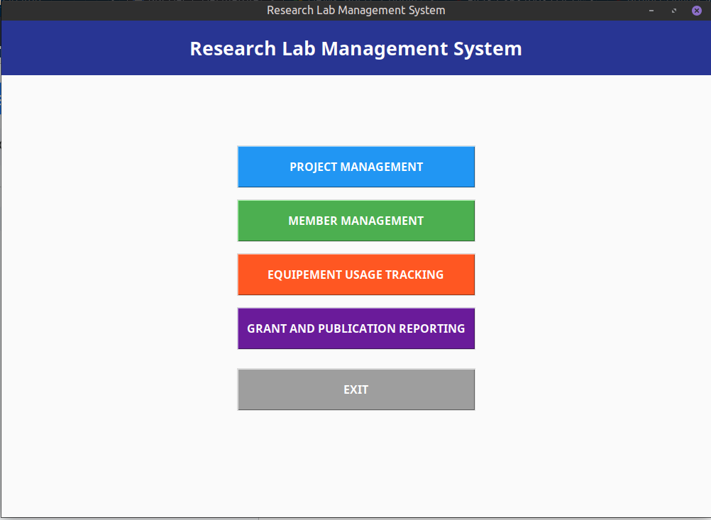
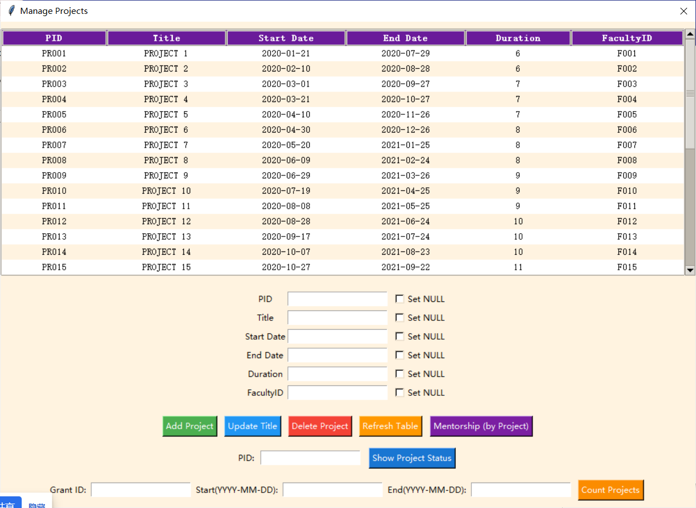
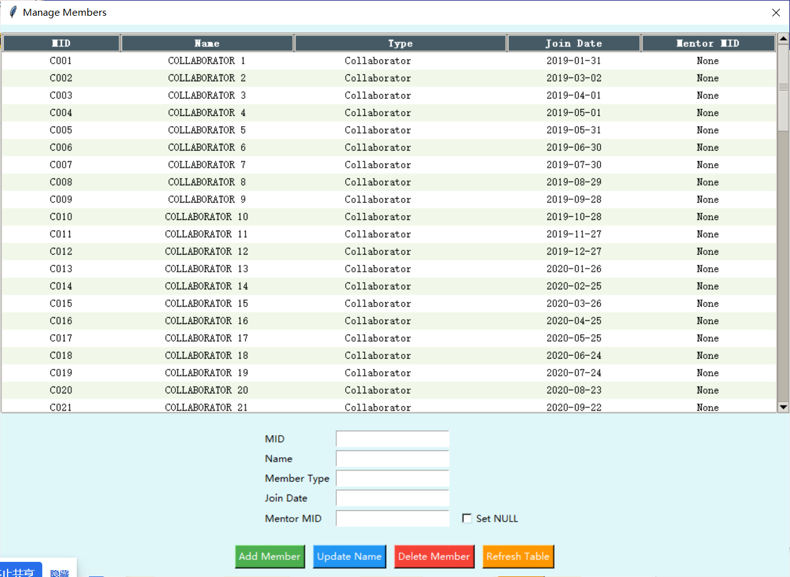
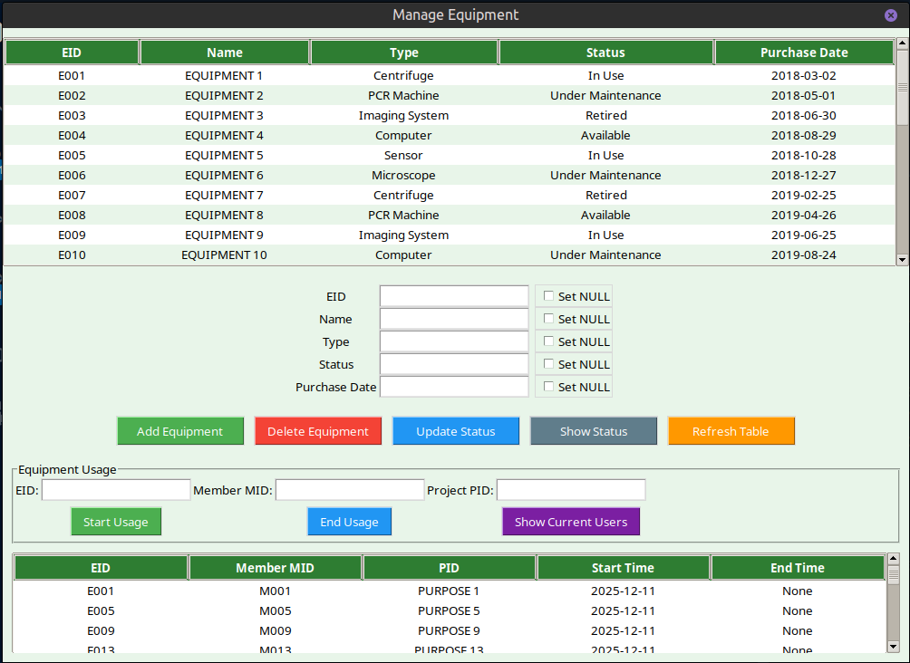
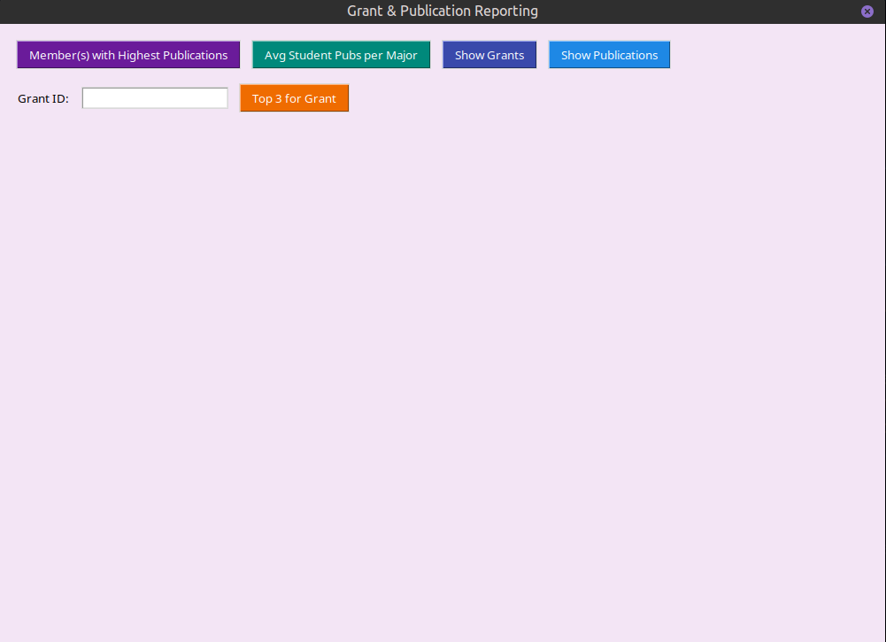

# RESEARCH LAB MANAGEMENT SYSTEM
This repository provides a small Python-based management system with modules for equipment, members, projects and reporting. It exposes a simple interactive menu (`menu.py`) to perform operations.

## Requirements

- Python 3.8+ (3.10+ recommended)
- No external dependencies required by default.
- PostgreSQL 

## Quick start

1. (Optional) create and activate a virtual environment:

```bash
python3 -m venv .venv
source .venv/bin/activate
```

2. Run the interactive menu:

```bash
python3 menu.py
```

The menu will guide you through creating and managing equipment, members, projects and reports.

## Project layout

- `menu.py` — main CLI entrypoint
- `create.py`, `insert.py`, `database.py`, `triggers.py` — DB and setup helpers
- `modules/` — core application modules
  - `equipment.py` — equipment-related functions
  - `members.py` — member management
  - `projects.py` — project handling
  - `reporting.py` — report generation
- `scripts/` — utility scripts

## Notes

- Add a `requirements.txt` if your project grows to include third-party packages.
- Database files and sensitive items are excluded via `.gitignore`.

## Contributing

Open an issue or submit a pull request. Keep changes small and add tests where relevant.

## License

No license specified. Add a `LICENSE` file if you want to publish this project under an open-source license.

## Screenshots

The repository includes a `screenshots/` folder with UI captures. Embed images by referencing the relative paths below.


- Main UI / List view:



- Projects management:



- Members management:



- Equipment management:



- Grants / Statistics view:



